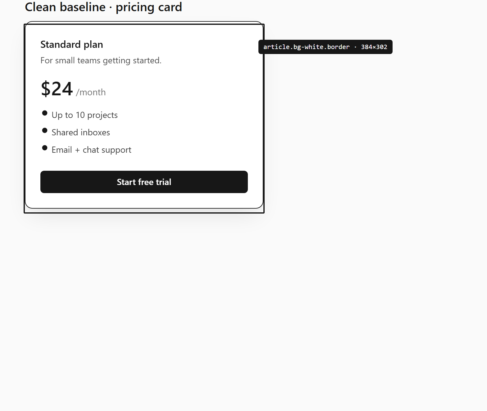
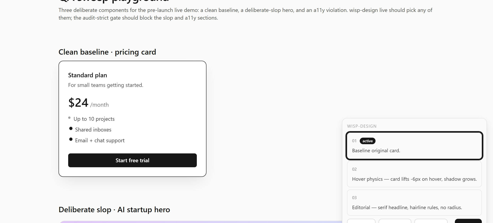
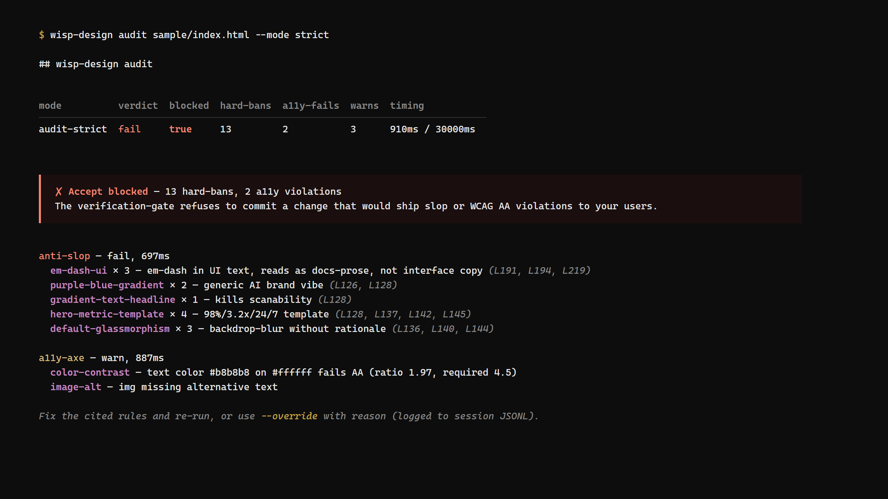

<p align="center">
  
</p>

<p align="center">
  
</p>

<p align="center">
  <a href="https://github.com/Samuel0101010/wisp-design/releases"></a>
  <a href="LICENSE"></a>
  
  =20">
  
</p>

# wisp-design

Live frontend design for Claude Code, with the verification gate every other tool forgot.

Click any element in your running dev server, type what you want changed, see **three distinct variants** render via HMR in the real page (not a fake canvas), tune their parameters with sliders that don't call the agent, and accept the one you like — at which point wisp-design splices the change into your actual source file and **refuses to let you ship if it broke contrast, blew up the console, or violated one of the anti-AI-slop rules baked into the plugin**.

Three variants on a hero CTA. Variant 2 looks great but its blue dropped contrast from 7.1 to 3.8. The cycle bar shows the warning, you press `r` to revert, try `1`, accept. A `tailwind.config.ts` patch lands in `git diff` half a second later. The console is clean. The screenshot trio at 375/768/1280 looks right. The slop-linter is happy. Done.

## What it looks like

<p align="center">
  
</p>

<p align="center"><em>Pick mode — hover any element, magenta border + tag tooltip. Click to configure.</em></p>

<p align="center">
  
</p>

<p align="center"><em>Cycle mode — three distinct variants, per-variant a11y delta badge, slider-tunable CSS params, 1-sentence rationale on hover.</em></p>

<p align="center">
  
</p>

<p align="center"><em>Verification gate — accept blocked because contrast fell below WCAG AA. The rule that fired is cited; one keystroke reveals the quick-fix.</em></p>

## Install

Inside any Claude Code session:

```text
/plugin marketplace add Samuel0101010/wisp-design
/plugin install wisp-design@wisp
```

Claude Code clones the repo, registers the `/wisp-design` slash command, the `wisp-design` skill, and the `UserPromptSubmit`/`PostToolUse`/`Stop` hooks automatically. No `settings.json` edit required. The plugin ships its built `dist/` bundle — first launch has no network fetch.

## Verify the install

```text
node "${CLAUDE_PLUGIN_ROOT}/dist/index.js" doctor --repo .
```

Prints `OK` / `WARN` / `FAIL` for: git repo present, binary reachable, plugin manifest reachable, bridge can bind to a free port, axe-core loadable, skill corpus indexed. If everything is `OK` or only `WARN`s, the plugin is healthy and ready for `/wisp-design live`.

## Use

Once your dev server (`next dev`, `vite`, `pnpm dev`, anything with HMR) is running:

```text
/wisp-design live
```

— or say *"let's redesign this hero"* / *"make the pricing cards feel more like Linear"* in chat and the skill triggers the live mode for you.

### Slash-Commands

| Command | What it does |
|---|---|
| `/wisp-design init` | One-time project setup. Scans stack, writes `.wisp/brand-spec.json`, extracts design tokens, asks the 4 Narrative Questions (Role / Distance / Temperature / Capacity). |
| `/wisp-design live` | Boots local HTTP+SSE bridge on a free port, injects `<script src=…/live.js>` reversibly into your dev entry, starts the variant poll-loop. |
| `/wisp-design audit` | Pre-commit gate. Runs anti-slop linter + a11y-axe-delta on every changed UI file. |
| `/wisp-design history` | Renders `.wisp/sessions/<id>.jsonl` as an interactive timeline — every variant, every decision, every gate-decision the plugin made today. |
| `/wisp-design tokens extract` | Samples computed styles across representative pages, clusters them, writes `.wisp/design-tokens.json` even if you started without a design system. |
| `/wisp-design sync --from "<vault-path>"` | Pulls your own pattern-docs from an Obsidian vault into the plugin's skill corpus so it grounds variants in *your* taste, not generic shadcn defaults. |

### Hotkeys (in the floating bar)

| Key | Action |
|---|---|
| `1` `2` `3` | jump to variant 1 / 2 / 3 |
| `n` / `p` | next / previous variant |
| `t` | open Tune popover (CSS-var sliders) |
| `a` | accept active variant |
| `r` | discard and re-prompt |
| `m` | toggle morph-mode (interpolate between two variants) |
| `v` | toggle viewport-trio (375 / 768 / 1280) |
| `Esc` | exit pick mode |

### The Verification Gate

Before any accept, the gate runs in parallel (p95 ≤ 3s):

| Check | Default | Strict (`--strict`) |
|---|---|---|
| WCAG AA contrast | warn on drop | block accept |
| Console errors / warnings | warn on new | block accept |
| Anti-AI-slop linter (em-dashes in UI, generic AI gradients, glassmorphism-default, hero-metric-template, side-stripe borders, purple-blue-gradient, …) | warn on hit | block accept |
| Multi-viewport screenshot diff (375/768/1280/1920 × light/dark) | render check | render check |
| Tab-order focus-trap leak | warn | block |
| `prefers-reduced-motion` render diff | warn if differs | block if differs |

Every blocked accept cites the exact rule and offers a one-keystroke quick-fix. Override is possible with `Shift+a`; the override is logged to the session JSONL so you can audit what was force-shipped later.

## How it works

```
Claude Code agent ──► /wisp-design live ──► local HTTP+SSE bridge :auto-port
        │                                          │
        │                                          ▼
        │                          inject <script src=…/live.js> into dev entry
        │                                          │  (byte-reversible, CSP auto-patched)
        │                                          ▼
        │                          user clicks element in browser
        │                                          │
        │                                          ▼
        │                          floating bar: action + freeform prompt + count
        │                                          │
        │                                          ▼
        ▼                          POST /events → bridge → long-poll wakes agent
   agent generates 3 variants ── inserts markers + <style data-wisp-css> + 3 <div data-wisp-variant>
        │                          using CSS @scope for safe coexistence
        ▼
   dev-server HMR fires ── browser cycles variants, sliders tune CSS params (no agent round-trip)
        │
        ▼
   user presses `a` ──► Verification Gate (a11y + screenshots + console + slop-linter)
        │
        ▼
   PASS ──► fs.writeFileSync line-range splice into source ──► carbonize @scope → permanent CSS
                                                                                  │
                                                                                  ▼
                                                                            git diff is clean
```

Full architecture: [`docs/architecture.md`](docs/architecture.md). Detailed comparison vs Impeccable / Stagewise / Onlook / Anthropic Claude Design: [`docs/comparison.md`](docs/comparison.md).

## Why not Impeccable

Impeccable (29.4k★) is the reference architecture for this kind of live loop — and we adopt almost all of it. But Impeccable's author has shipped the live-edit mode as a footnote (one line in the README) and left 15 known gaps unfilled. wisp-design fills them:

| Gap in Impeccable | wisp-design |
|---|---|
| Single-element selection only | Multi-element via ⌘-click-add |
| No undo beyond accept/discard | Per-session edit stack with cross-cycle undo/redo (`.wisp/sessions/*.jsonl`) |
| Hardcoded 3 variants always | Adaptive 1/3/5/8 + morph-between-two mode |
| No design-token extraction | First-time sample + cluster → `.wisp/design-tokens.json` |
| PNG-flattened annotations | Structured `{target, kind, note}` signals |
| Fixed port `:8400` | Auto-discovery + lockfile |
| No session history | `wisp-design history` interactive replay |
| No a11y delta | Per-variant axe-core delta in cycle bar |
| No AA-blocking accept | `--strict` mode refuses accept on contrast drop |
| CSS-only variants | Structure-variant mode via `--structural` (different JSX subtrees) |
| Markdown-policy reload | In-session policy-diff proposals |
| Single tab, single user | Multi-cursor session URLs via SSE-fanout |
| HMR-only | Manual-refresh SSE signal for non-HMR frameworks |
| No component-library awareness | Detects shadcn/Radix/MUI → prefers prop edits over CSS overrides |
| No per-variant rationale | 1-sentence rationale in SSE payload, shown on hover |

## Why not Stagewise / Onlook

Stagewise (6.7k★, AGPL) and Onlook (25.8k★, Apache-2.0) both have the live-edit roundtrip — but as **standalone tools**, not as Claude Code plugins. That means context-switching out of your editor, a separate process model, AGPL friction (Stagewise), and no native handle into Claude Code's hook system. wisp-design is the same loop **as a CC-plugin**, with `Stop`-hook-driven verification gating that those tools structurally can't deliver.

## Why not v0 / Lovable / bolt.new

Those are web sandboxes. They generate components in *their* environment, then you copy-paste. wisp-design edits *your* source files in *your* dev server with *your* design tokens. The artifact is a `git diff`, not a download.

## Why not Anthropic "Claude Design"

Anthropic shipped a SaaS-style design surface powered by Opus 4.7, and the frontend-design Skill it builds on has 760k installs. We're not competing on canvas design or marketing pages — we're the **engineer-facing, local, source-edit-first complement** to it. If you want a designer-grade canvas in a browser tab, that's Claude Design. If you want to click your running app and have Claude write the source file directly, that's wisp-design.

## Related — the wisp suite

Same author, complementary plugins. Each one solves a single sharp pain in the Claude-Code-as-builder workflow.

| Plugin | Stage of the loop |
|---|---|
| [**wisp-orchestrator**](https://github.com/Samuel0101010/wisp-orchestrator) | Plan + spawn + watch multi-agent runs |
| [**wisp-agentdiff**](https://github.com/Samuel0101010/wisp-agentdiff) | Review + approve + merge per-agent worktrees |
| [**wisp-receipt**](https://github.com/Samuel0101010/wisp-receipt) | Block "fertig"-claims that aren't backed by an evidence ledger |
| **wisp-design** *(this repo)* | Live-edit the running frontend with three variants, a11y-gated accept, source-file splice |

## Status & roadmap

Pre-release. Eight phases tracked in [`CLAUDE.md`](CLAUDE.md). v0.1.0-prerelease ships Phase 0 (scaffolding + plugin manifest); v1.0.0 ships the full Verification-Gate + Session-Replay loop. Issues and PRs welcome once we go public — for now the repo is private until v1.0.0.

## Develop

```bash
npm install
npm run check          # lint + typecheck + test + build
npm run test:watch
npm run dev            # tsup watch
```

CI matrix (planned): Linux / macOS / Windows × Node 20 + 22.

## License

MIT — see [`LICENSE`](LICENSE).

Forked content from [pbakaus/impeccable](https://github.com/pbakaus/impeccable) (architecture inspiration, Apache-2.0), [nextlevelbuilder/ui-ux-pro-max-skill](https://github.com/nextlevelbuilder/ui-ux-pro-max-skill) (CSV corpus, MIT) and [alchaincyf/huashu-design](https://github.com/alchaincyf/huashu-design) (anti-slop doctrine, MIT) is used with full attribution in [`docs/attribution.md`](docs/attribution.md).
